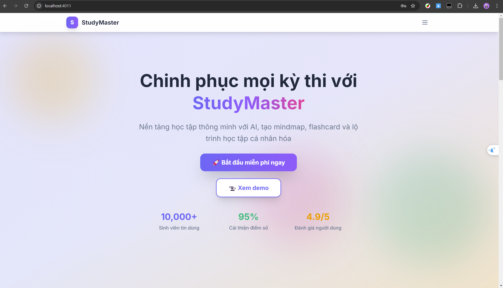
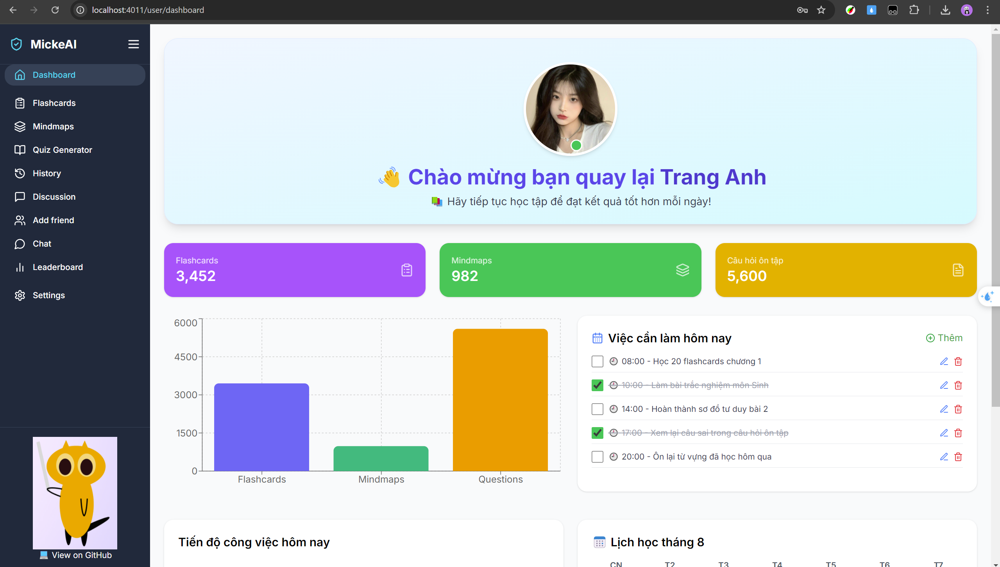
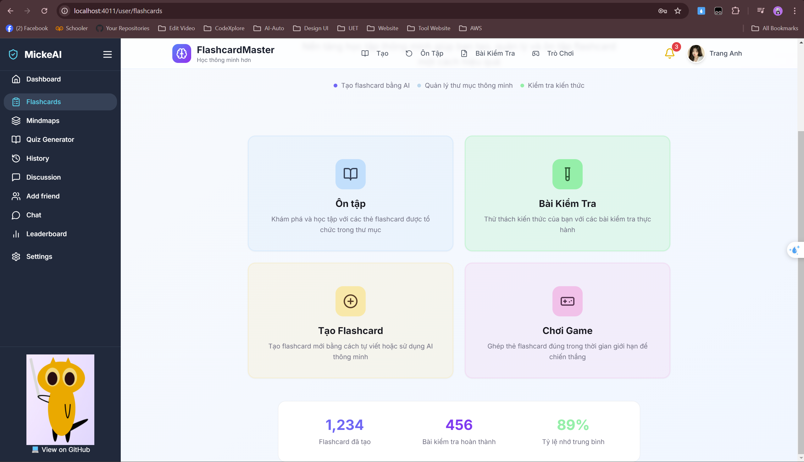
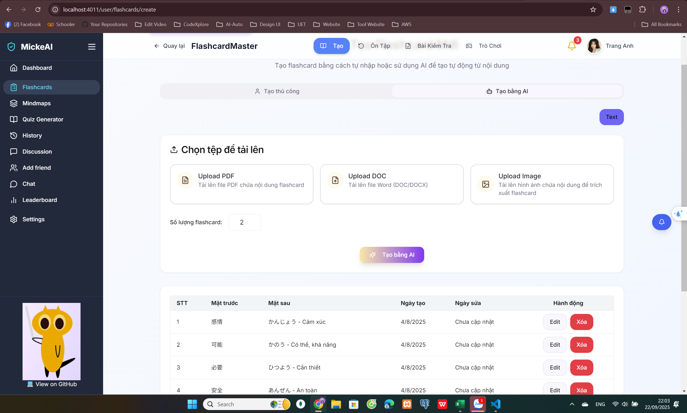
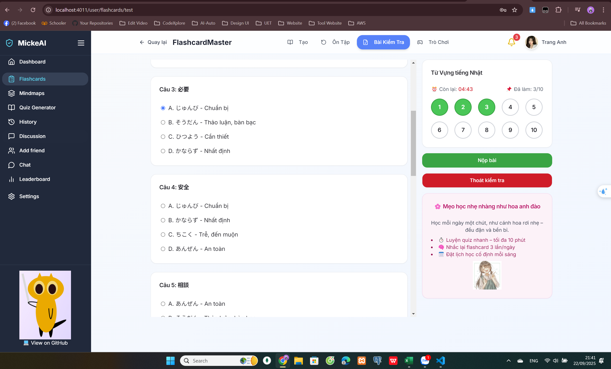
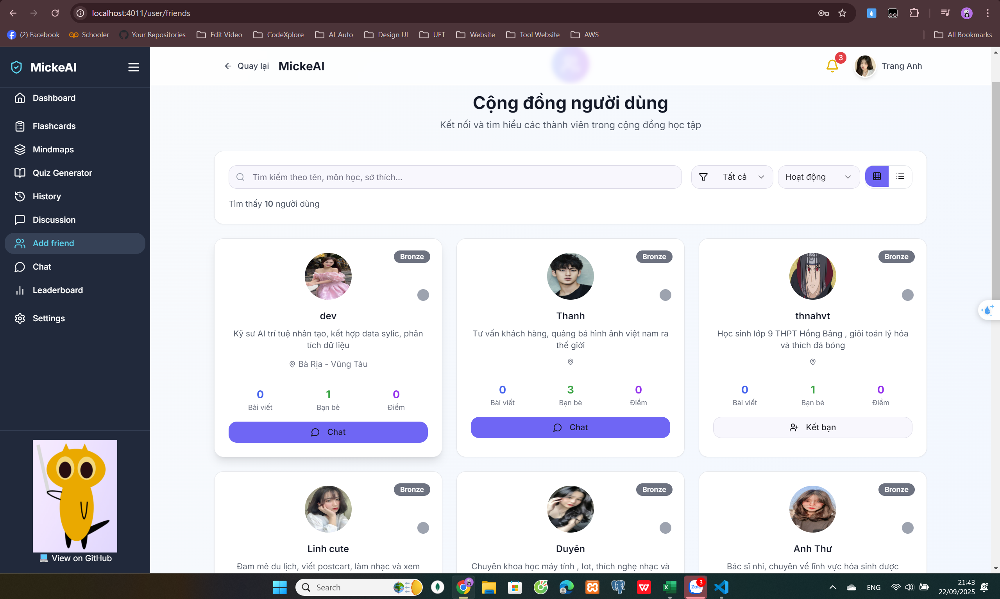
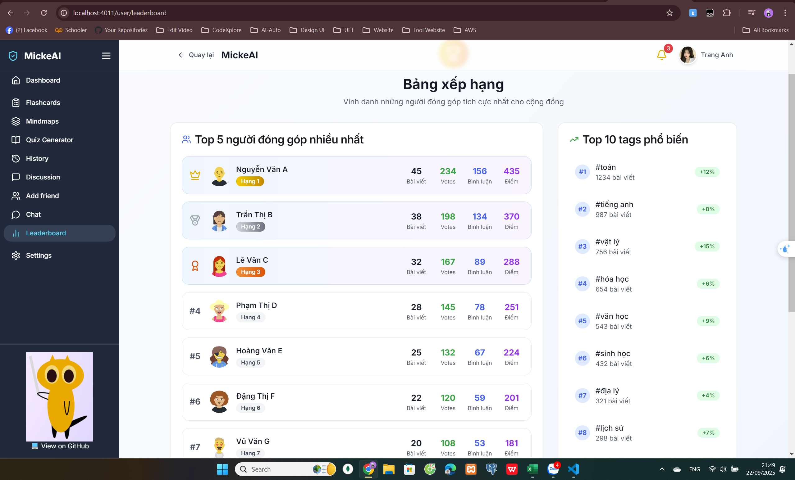
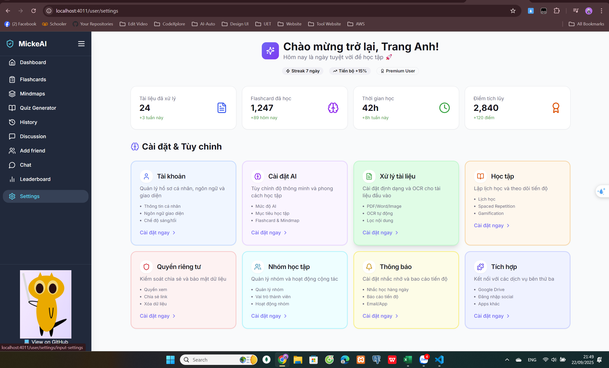

# Hackathon2025_StudyMate 🧠


<!--  -->
[](https://nodejs.org/)
[](https://www.postgresql.org/)
[](LICENSE)
[](https://github.com/<your-username>/Hackathon2025_StudyMate/actions)
<details>
<summary><strong>Tiếng Việt</strong></summary>

> Nền tảng học tập thông minh: Tạo Flashcard, Quiz, Mindmap từ AI (Text / PDF / DOC / Image).  
> Có chế độ học, ôn luyện, thi, trò chơi, kết bạn, cộng đồng hỏi–đáp, và hệ thống huy hiệu/thưởng.

## 📚 Mục lục
<summary>📖 Bấm để xem</summary>

-  [🔗 Đường dẫn](#links-vi)
- [🚀 Giới thiệu](#overview)
- [✨ Tính năng chính](#features)
- [🛠 Công nghệ sử dụng](#tech)
- [📸 Ảnh / GIF demo](#demo)
- [⚙️ Cài đặt & Chạy dự án](#install)
- [📂 Cấu trúc thư mục](#structure)
-  [🚀 Cải tiến trong tương lai](#future-vi)


## 🔗 Đường dẫn <a id="links-vi"></a>

-   Video demo: [YouTube](https://www.youtube.com/watch?v=oxVCXuJaLV4&t=4s)

## 🚀 Giới thiệu <a id="overview"></a>

Hackathon2025_StudyMate là nền tảng hỗ trợ học tập hiệu quả, giúp bạn:

- Tạo nhanh **Flashcard, Quiz, Mindmap** từ nội dung văn bản hoặc file.  
- Ôn tập thông minh theo **spaced repetition**.  
- Tổ chức **thi thử, chơi game học tập**.  
- **Kết nối bạn bè**, chia sẻ tài liệu.  
- Tham gia **cộng đồng học tập** đa lĩnh vực.

## ✨ Tính năng chính <a id="features"></a>
### 1️⃣ Tạo nội dung học tập từ AI

- Nhập **Text** hoặc upload **PDF / DOC / Image**.  
- AI tạo **Mindmap, Flashcard, Quiz**.  
- Tuỳ chỉnh **độ khó, số lượng câu hỏi**.

### 2️⃣ Chế độ học – ôn – kiểm tra – trò chơi

- **Study Mode**: học với Flashcard, ôn theo lịch lặp thông minh.  
- **Review Mode**: làm Quiz, hiển thị đáp án ngay.  
- **Exam Mode**: thi thử với thời gian đếm ngược.  
- **Games**: ghép cặp, trả lời nhanh, leo bảng xếp hạng.

### 3️⃣ Mindmap tương tác

- Sơ đồ tư duy sinh từ AI.  
- Kéo thả chỉnh sửa, xuất **ảnh / PDF**.

### 4️⃣ Cộng đồng & kết bạn

- Kết nối người dùng, chat, gửi tài liệu.  
- Diễn đàn hỏi–đáp, bình luận, like, đánh giá.  
- **Huy hiệu, bảng xếp hạng** cho người đóng góp tích cực.

## 🛠 Công nghệ sử dụng <a id="tech"></a>

| Phần     | Công nghệ / Thư viện                   |
| -------- | -------------------------------------- |
| Frontend | React + Vite + TailwindCSS + shadcn/ui |
| Backend  | Node.js 20 / 22, Express, Socket.IO    |
| Database | PostgreSQL + Drizzle ORM               |
| Cloud    | Cloudinary                             |
| AI       | Google Gemini API                      |
| Auth     | JWT                                    |

---

## 📸 Ảnh / GIF demo <a id="demo"></a>

<div align="center">













</div>

---

## ⚙️ Cài đặt & Chạy dự án <a id="install"></a>

### Yêu cầu

- Node.js v20.14.0 hoặc v22.14.0  
- PostgreSQL 14+  
- Cloudinary account  
- Google Gemini API key  

### Bước cài đặt (Development)

```bash
# 1. Clone project
git clone https://github.com/kimmttrung/Hackathon2025_StudyMate.git

# 2. Cài thư viện
cd 00 nhấn tab + enter
npm i
cd 01 nhấn tab + enter
npm i

# 3. Cập nhật file .env
cp .env.example -> .env
# chỉnh sửa DATABASE_URL, CLOUDINARY, GEMINI_API_KEY, ...

# 4. Chạy dự án
npm start

```


## 📂 Cấu trúc thư mục <a id="structure"></a>
```bash
00-frontend-react-mindmap/
│── public/ # Static files (ảnh, favicon, ...)
│── src/
│ ├── components/ # Các component tái sử dụng
│ ├── data/ # Dữ liệu tĩnh hoặc mock data
│ ├── hooks/ # Custom React hooks
│ ├── pages/ # Các page chính của ứng dụng
│ ├── styles/ # File CSS/Tailwind tuỳ chỉnh
│ ├── utils/ # Hàm tiện ích (helper functions)
│ ├── App.jsx # Component gốc
│ ├── main.jsx # Entry point, render React
│ └── Routes.jsx # Định nghĩa routes
│
│── .env # Config biến môi trường (FE)
│── index.html # Entry HTML
│── package.json # Quản lý dependencies
│── tailwind.config.js # Cấu hình TailwindCSS
│── vite.config.js # Cấu hình Vite

01-backend-nodejs-postgres/
│── src/
│ ├── config/ # Cấu hình DB, env, ...
│ ├── controllers/ # Xử lý logic request/response
│ ├── middleware/ # Middleware (auth, validate, ...)
│ ├── models/ # Định nghĩa model kết nối DB
│ ├── routes/ # Định nghĩa API routes
│ ├── services/ # Business logic/service layer
│ ├── temp/ # Thư mục tạm
│ ├── utils/ # Hàm tiện ích
│ ├── views/ # Template/view (nếu có)
│ └── server.js # Entry point khởi động server
│
│── uploads/ # Lưu file upload
│── .env # Config biến môi trường (BE)
│── package.json # Quản lý dependencies
```

## 🚀 Cải tiến trong tương lai <a id="future-vi"></a>
- **AI cá nhân hoá lộ trình học tập**: đề xuất tài liệu, quiz, flashcard dựa trên năng lực & tiến bộ của từng người.  
- **Nhận diện giọng nói & chấm điểm phát âm**: hỗ trợ luyện kỹ năng Speaking (IELTS/TOEIC/Ngôn ngữ khác).  
- **Gamification nâng cao**: thêm nhiệm vụ hằng ngày, hệ thống điểm kinh nghiệm (XP), vật phẩm ảo, và sự kiện thi đấu nhóm.  
- **Tích hợp nhiều nguồn tài liệu**: kết nối Google Drive, Notion, GitHub, Wikipedia để tạo nội dung học tập tự động.  
- **Ứng dụng di động (iOS/Android)**: đồng bộ với bản web, học mọi lúc mọi nơi.  
- **Chế độ học nhóm trực tuyến**: nhiều người cùng tham gia một quiz/game theo thời gian thực.  
- **Phân tích dữ liệu học tập**: biểu đồ tiến bộ, dự đoán điểm số, gợi ý cải thiện kỹ năng yếu.  
- **Hỗ trợ nhiều ngôn ngữ**: Việt, Anh, Nhật, Hàn... để mở rộng cộng đồng quốc tế.  
</details>

<details>
<summary><strong>日本語</strong></summary>


> スマート学習プラットフォーム：AIによるフラッシュカード・クイズ・マインドマップ生成（Text / PDF / DOC / Image 対応）
> 学習モード・復習モード・試験モード・ゲーム・フレンド機能・Q&Aコミュニティ・バッジ/報酬システムを搭載。

## 📚 目次
<summary>📖 クリックして表示</summary>

-  [🔗 リンク](#link1)
- [🚀 概要](#link2)
- [✨ 主な機能](#link3)
- [🛠 使用技術](#link4)
- [📸 デモ画像 / GIF](#link5)
- [⚙️ インストール & プロジェクト実行方法](#link6)
- [📂 ディレクトリ構成](#link7)
- [🚀 今後の改善予定](#link8)


## 🔗 リンク <a id="link1"></a>

-  デモ動画: [YouTube](https://www.youtube.com/watch?v=oxVCXuJaLV4&t=4s)

## 🚀 概要 <a id="link2"></a>

Hackathon2025_StudyMate は、効率的な学習をサポートするプラットフォームです。

- テキストやファイルから フラッシュカード・クイズ・マインドマップ を即生成
- 間隔反復（spaced repetition）による復習機能
- 模擬試験・学習ゲームモード
- フレンドとつながり、資料を共有
- 多分野の学習コミュニティに参加可能

## ✨ 主な機能 <a id="link3"></a>
### 1️⃣ AIによる学習コンテンツ生成

- テキスト入力 または PDF / DOC / 画像をアップロード 
- AIが マインドマップ・フラッシュカード・クイズ を自動生成
- 難易度や問題数のカスタマイズ可能

### 2️⃣ 学習・復習・テスト・ゲームモード

- **Study Mode**: フラッシュカードで学習 & 賢い復習スケジュール
- **Review Mode**: クイズを解いて即フィードバック 
- **Exam Mode**: タイマー付き模擬試験
- **Games**: マッチング・早押し・ランキングバトル

### 3️⃣ インタラクティブ・マインドマップ

- AIが生成した思考マップを表示
- ドラッグ操作で編集可能・画像 / PDFでエクスポート

### 4️⃣ コミュニティ & フレンド機能

- ユーザー同士のつながり・チャット・資料共有
- Q&A掲示板・コメント・いいね・評価機能
- 貢献ユーザー向けバッジ・ランキング

## 🛠 使用技術 <a id="link4"></a>

| パート   | 技術 / ライブラリ                      |
| -------- | -------------------------------------- |
| Frontend | React + Vite + TailwindCSS + shadcn/ui |
| Backend  | Node.js 20 / 22, Express, Socket.IO    |
| Database | PostgreSQL + Drizzle ORM               |
| Cloud    | Cloudinary                             |
| AI       | Google Gemini API                      |
| Auth     | JWT                                    |

---

## 📸 デモ画像 / GIF <a id="link5"></a>

<div align="center">


</div>

---

## ⚙️ インストール & プロジェクト実行方法 <a id="link6"></a>

### 必要環境

- Node.js v20.14.0 or v22.14.0  
- PostgreSQL 14+  
- React 19
- Cloudinary account  
- Google Gemini API key  

### セットアップ手順（開発環境）

```bash
# 1. プロジェクトをクローン
git clone https://github.com/kimmttrung/Hackathon2025_StudyMate.git

# 2. ライブラリをインストール
cd 00 （Tabキー → Enter）
npm i
cd 01 （Tabキー → Enter）
npm i

# 3. .env ファイルを設定
cp .env.example -> .env
# DATABASE_URL, CLOUDINARY, GEMINI_API_KEY などを編集

# 4. プロジェクトを起動
npm start

```

## 📂 ディレクトリ構成 <a id="link7"></a>
```bash
00-frontend-react-mindmap/
│── public/ # Static files (ảnh, favicon, ...)
│── src/
│ ├── components/ # Các component tái sử dụng
│ ├── data/ # Dữ liệu tĩnh hoặc mock data
│ ├── hooks/ # Custom React hooks
│ ├── pages/ # Các page chính của ứng dụng
│ ├── styles/ # File CSS/Tailwind tuỳ chỉnh
│ ├── utils/ # Hàm tiện ích (helper functions)
│ ├── App.jsx # Component gốc
│ ├── main.jsx # Entry point, render React
│ └── Routes.jsx # Định nghĩa routes
│
│── .env # Config biến môi trường (FE)
│── index.html # Entry HTML
│── package.json # Quản lý dependencies
│── tailwind.config.js # Cấu hình TailwindCSS
│── vite.config.js # Cấu hình Vite

01-backend-nodejs-postgres/
│── src/
│ ├── config/ # Cấu hình DB, env, ...
│ ├── controllers/ # Xử lý logic request/response
│ ├── middleware/ # Middleware (auth, validate, ...)
│ ├── models/ # Định nghĩa model kết nối DB
│ ├── routes/ # Định nghĩa API routes
│ ├── services/ # Business logic/service layer
│ ├── temp/ # Thư mục tạm
│ ├── utils/ # Hàm tiện ích
│ ├── views/ # Template/view (nếu có)
│ └── server.js # Entry point khởi động server
│
│── uploads/ # Lưu file upload
│── .env # Config biến môi trường (BE)
│── package.json # Quản lý dependencies
```

## 🚀 今後の改善予定 <a id="link8"></a>
- AIによる学習プランのパーソナライズ：各ユーザーの能力と進捗に応じた資料・クイズ・フラッシュカードを自動提案。  
- 音声認識 & 発音採点機能：IELTS／TOEIC／その他言語学習向けのスピーキング練習をサポート。
- 高度なゲーミフィケーション：デイリーミッション、経験値（XP）システム、バーチャルアイテム、チーム対抗イベントを追加。
- 多様な情報ソースとの連携：Google Drive・Notion・GitHub・Wikipedia から自動で学習コンテンツを生成。
- モバイルアプリ（iOS / Android）対応：Web版と同期し、いつでもどこでも学習可能。
- オンライン協力モード：複数人でリアルタイムにクイズやゲームに参加。
- 学習データ分析：進捗グラフ、スコア予測、弱点スキルの改善提案。
- 多言語対応：ベトナム語・英語・日本語・韓国語など、国際コミュニティに向けて拡張。

</details>
<!-- <details>
<summary><strong>English</strong></summary>
</details> -->
